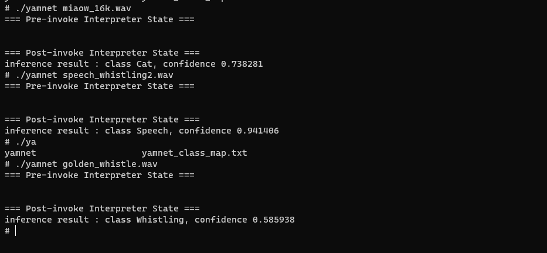

# TensorFlow Lite C++ minimal example

This example shows how you can build a simple TensorFlow Lite application.

#### Step 1. Install CMake tool

It requires CMake 3.16 or higher. On Ubuntu, you can simply run the following
command.

```sh
sudo apt-get install cmake
```

Or you can follow
[the official cmake installation guide](https://cmake.org/install/)

#### Step 2. Clone TensorFlow repository

```sh
git clone https://github.com/tensorflow/tensorflow.git tensorflow
git checkout origin/r2.10
```

#### Step 3. Create CMake build directory and run CMake tool

```sh
# move current directory to tensorflow_root/tensorflow/lite/examples

mkdir build_yamnet
cd build_yamnet
cmake -DCMAKE_TOOLCHAIN_FILE=/home/yons/data/ohos-sdk/linux/native/build/cmake/ohos.toolchain.cmake -DTFLITE_ENABLE_XNNPACK=OFF ../tensorflow/lite/examples/yamnet

# enter tensorflow root path, patch different
cd ../
patch -p0 build_yamnet/flatbuffers/include/flatbuffers/util.h flatbuffers_util_h.diff
patch -p0 build_yamnet/flatbuffers/src/util.cpp flatbuffers_util_cpp.diff
patch -p0 build_yamnet/cpuinfo/CMakeLists.txt  cpuinfo.diff

# re cmake configuration and build

cd build_yamnet
cmake -DCMAKE_TOOLCHAIN_FILE=/home/yons/data/ohos-sdk/linux/native/build/cmake/ohos.toolchain.cmake -DTFLITE_ENABLE_XNNPACK=OFF ../tensorflow/lite/examples/yamnet
cmake --build ./ -j20

```

#### Step 4. copy binary file and related file to openHarmony device through device

* make sure that connect to device. 
```
hdc list targets
hdc shell
```


```sh
# In the build_yamnet directory
hdc file send yamnet /data
hdc file send yamnet_class_map.txt /data
hdc file send miaow_16k.wav /data
hdc file send golden_whistle.wav  /data
hdc file send speech_whistling2.wav /data
# copy libc++_shared.so from ohos-sdk cross compile toolchain
hdc file send libc++_shared.so /data

```
#### Step 5. execute binary programation in OHOS 

```
hdc shell
cd data
export LD_LIBRARY_PATH=./:$LD_LIBRARY_PATH
./yamnet wav_filepath

# 从上面三个文件选一
golden_whistle.wav
miaow_16k.wav
speech_whistling2.wav
```
#### Step 5. result
